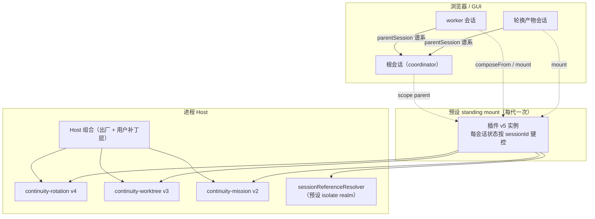
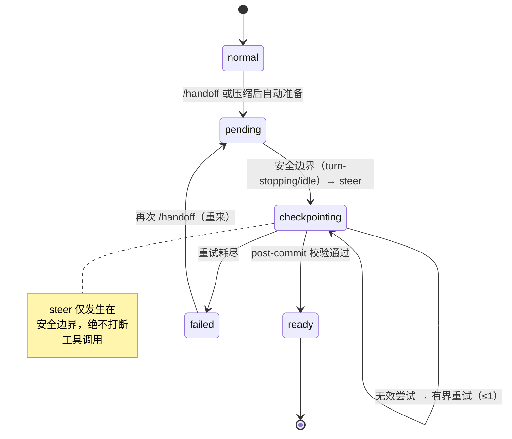
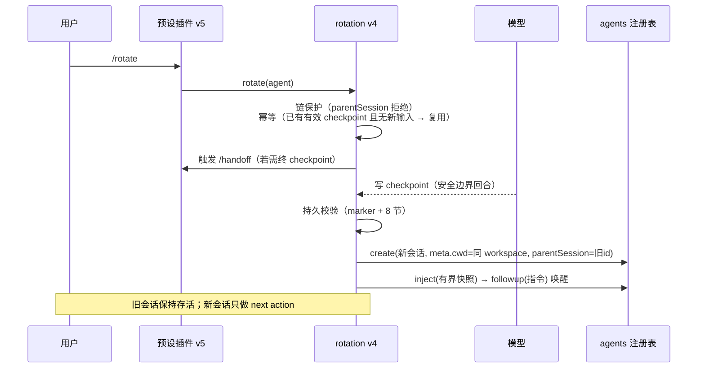
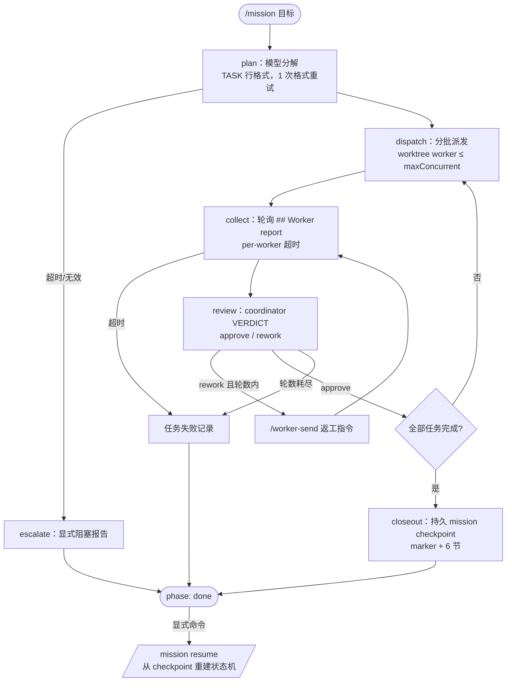
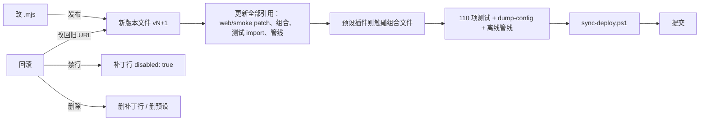

# ARCHITECTURE.md — Orchestra（乐团模式）架构

> 目标读者：想理解或修改本项目的开发者。
> 所有结论均来自实测（源码级验证 + 真实会话冒烟），非推断。

## 1. 目标与设计原则

把"上下文连续性"做成 DeepSeek Harness 的用户级系统能力：

- **持久**：文件全部位于用户自有目录（`~/.dsh`），重启即恢复，不随会话消散；
- **可验证**：交接产物（checkpoint/mission）带标记、有必需章节、持久化在会话日志中，读取方校验而非信任；
- **有界**：所有自动机制带超时/轮数/预算上限，失败显式升级，绝不静默扩张；
- **可回滚**：版本化文件 + 补丁层，任何一步都能退回上一版本；
- **零侵入**：不修改出厂安装、不动业务仓库、不动 Host 组合的出厂部分。

## 2. 平面划分

| 平面 | 职责 | 实例 |
|---|---|---|
| **Host**（进程单例，跨会话） | 会话/Agent 创建、跨会话快照、token 计量、worktree 授权、mission 编排循环 | 三个驱动器（经用户 profile 补丁层挂载） |
| **预设**（每会话一份） | 命令、角色 prompt、每会话状态机、Host 服务消费 | `continuity` 预设 + 伴生插件 |

硬性规则：预设行发布 Service 必须置于 `isolate` realm 组（本项目的 `sessionReferenceResolver` 即如此）；驱动器只做调用期惰性 `ctx.get`。

## 3. 组件清单（当前版本）

| 组件 | 版本 | 真实文件 | 发布/注册 | 命令面 |
|---|---|---|---|---|
| 预设插件 | v5 | `.agent-presets\continuity\continuity-plugin.v5.mjs` | 12 条命令 + `continuity-roles` prompt 段 | 全部专属命令 |
| 轮换驱动器 | v4 | `continuity-host\continuity-rotation.v4.mjs` | `continuityRotation` | `/rotate`、`/worker-successor`（经预设） |
| worktree 驱动器 | v3 | `continuity-host\continuity-worktree.v3.mjs` | `continuityWorktree` | `/worktree` `/workers` `/worker-send` `/worker-stop` `/worker-report` `/worktree-cleanup` |
| mission 驱动器 | v2 | `continuity-host\continuity-mission.v2.mjs` | `continuityMission` | `/mission` `/mission resume` `/mission status` |

## 4. 运行时拓扑

要点：

- **standing mount**：预设组合按进程代次挂载一次，同代所有会话共享插件实例；状态按 `sessionId` 键控，互不串扰。
- **谱系**：worker/轮换产物/子代理都在 header 里带 `parentSession`——发现、追溯、链保护全部依赖它。
- **热应用**：补丁行换 URL 即热换驱动器（新模块 = 新 import）；预设插件换版需触碰组合文件开新代次（只影响之后的新会话）。

## 5. 交接状态机（预设插件）

持久性：`ready` 永远以日志中带标记的 `assistant/message`（seq）为证据；重启后由日志重推，**无假就绪**。

## 6. `/rotate` 时序（确认式轮换）

## 7. mission 编排循环（有界自动）

预算护栏：`maxTasks`/`maxConcurrent`/`planTimeoutMs`/`reviewTimeoutMs`/`workerTimeoutMs`/`workerRounds`/`missionTimeoutMs` 全部行内可配；任何超时只影响对应阶段并显式上报。

## 8. 持久事实与恢复

| 事实 | 存储 | 恢复方式 |
|---|---|---|
| 交接 checkpoint | 会话日志 `assistant/message`（marker + 8 节） | 日志反向扫描 + 校验；`/continue` 快照或日志召回注入 |
| mission checkpoint | coordinator 会话日志（mission marker + 6 节） | `/mission resume` 从 `## Goal` 节重建并续跑 |
| worker 记录 | 会话 header（`parentSession`/`cwd`/`delegationDepth`）+ `workspaceRegistry` | `sessionQuery.listSessions` 按父过滤；attach 后 GUI 分组可见 |
| 会话状态机 | 代内内存 Map | 重启归位；一切对外"就绪"状态均以持久事实为证据 |

## 9. 升级与回滚机制

## 10. 框架约束清单（实测，编号沿用 V4 设计文档）

- **G7** loader 按 URL 缓存模块、进程内不过期 → 版本化文件升级铁律。
- **G8** 补丁插入行 apply 可能早于依赖行加载 → 惰性 `ctx.get`。
- **G9** 轮换产物再轮换会无限递归 → 链保护。
- **G10** 动态插件沙箱不给 `ctx.fiber` → 驱动器必须是真实 host 行；失败诊断面 = `hmr/config-update-failed` + 离线管线。
- 另有：预设服务需 isolate realm；`session/event` 经 scope parent 可见；standing 代次以组合文件 stamp 换代；subagent 会话在 GUI 工作区组默认被客户端过滤（`ui-workspace/tree.ts` L118-119，PR 待合）。

## 11. 已知限制与路线图

| 项 | 状态 |
|---|---|
| mission 跨重启自动续跑 | `/mission resume` 显式续跑已实现；全自动恢复未做 |
| coordinator → worker 推送 | 仅存活 worker；持久报告永远可拉取 |
| 建议卡 UI（G3） | 未实现（`/continuity` 文本建议 + `/rotate` 即确认） |
| subagent 会话工作区可见 | 平台过滤，PR 分析就绪（方案 A 最小改动） |
| G2 per-child cwd seam | 未改框架，用 `agents.create` + 谱系绕开 |
