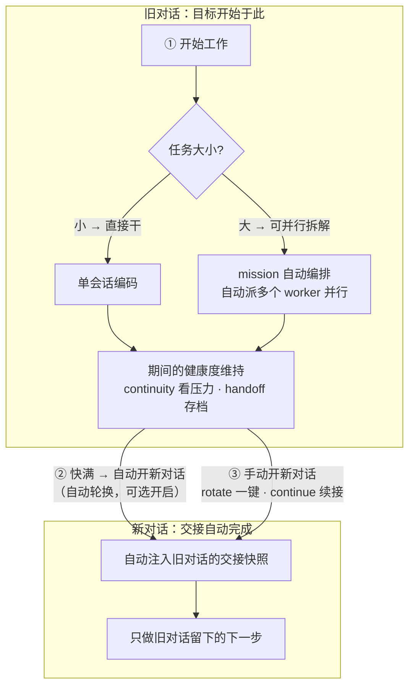
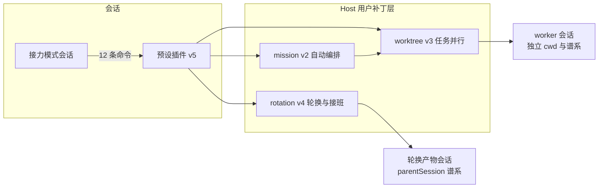

# 接力模式 · Continuity for DeepSeek Harness

> **上下文永不丢失的编码 Agent。** 压力可测、交接可验证、会话可续、任务可并行、目标可自动编排。
> 一个用户级预设 + 三个 host 驱动器，零侵入出厂安装，重启即恢复。

**Continuity** is a user-owned capability stack for DeepSeek Harness: a full coding-agent preset that measures context pressure, writes **verifiable handoff checkpoints**, continues across sessions, spins up **parallel worktree workers**, and runs a **bounded automatic mission loop** — all outside any business repository and without touching the shipped harness.

---

## 能力一览

| 能力 | 命令 | 说明 |
|---|---|---|
| 📊 上下文压力监测 | `/continuity` | 实测 tokens / 容量（未知即 unknown）/ 比率 / 压缩次数 / checkpoint 状态 / 分档建议 |
| 📝 可验证交接 | `/handoff` | 安全边界写带标记的 8 节 checkpoint，持久校验才算数，幂等 |
| 🔁 跨会话继续 | `/continue <id>` | 空白会话注入有界快照后唤醒，只做 checkpoint 的 next atomic action |
| 🔄 一键轮换 | `/rotate` | 终 checkpoint → 自动建新会话 → 注入 → 唤醒；链保护防递归 |
| 🌳 并行 worktree worker | `/worktree` 等 6 条 | Git worktree（或非 Git 兄弟目录）+ worker 会话 + 双向通道 |
| 🎯 自动 mission 编排 | `/mission <目标>` | 有界循环：分解 → 并行派发 → 审查 → 有界返工 → 持久 mission checkpoint |
| 👶 worker 接班 | `/worker-successor <id>` | worker 写终 checkpoint 后由 coordinator 显式派 successor 继承 |

共 **12 条专属命令** + 6 条继承自标准模式（`/compact` `/plan` `/goal` `/permission` `/feedback` `/export`）。完整参考见 [`docs/COMMANDS.md`](docs/COMMANDS.md)。

## 工作流：三种模式，两个对话框

一句话逻辑：**开始工作 → 任务小直接干、任务大走 mission；期间自动维持上下文健康；快满自动开新对话，或手动开新对话——前后交接自动完成。**



- **模式① 干活**：任务小就单会话直接干；任务大、可并行拆解就 `/mission`（自动拆解 → 派多个 worktree worker → 审查 → 收口，有超时/预算护栏，失败会明确报告，可 `/mission resume` 续跑）。
- **模式② 自动开新对话**：过程中上下文快满时自动轮换（默认仅"建议"，把补丁配置 `autoRollover` 改为 `auto` 即开启；永远只发生在安全边界，不打断正在跑的工具）。
- **模式③ 手动开新对话**：你随时可以 `/rotate` 一键开新对话，或事后 `/continue <旧对话id>` 续接——**两个对话的前后交接（快照注入 → 只做下一步）都是自动完成的**。
- 旧对话交接后**保持存活**，随时可回去看；新对话从旧对话的交接文档继续，不会乱跑。
- 多轮交接问答：目前交接是**单程**（写 → 注入 → 做一步）；多轮问答已存在于 mission 的审查-返工（coordinator 与 worker 之间，有界）；新旧对话之间的 3 轮问答是后续选项，设计图见 [`docs/STATES.md`](docs/STATES.md)。

| 你什么时候…… | 敲什么 | 手动还是自动 |
|---|---|---|
| 想看上下文还剩多少 | `/continuity` | 只读，随时可敲 |
| 想先存个档再继续 | `/handoff` | **半自动**：它挑安全时机（不打断你正在跑的工具），让模型写一份 8 节交接文档 |
| 想换个干净的新对话接着干 | `/rotate` | **半自动**：确认后自动写完交接文档 → 开新会话 → 注入快照 → 唤醒，新会话只做上一步 |
| 想从某个旧对话继续 | `/continue <id>` | **半自动**：自动注入旧对话快照后唤醒，按交接文档干活 |
| 想开一个并行任务 | `/worktree <任务>` | **半自动**：自动建 worktree + 派一个 worker 去干 |
| 想指挥 worker | `/workers` `/worker-report` `/worker-send` `/worker-stop` | 手动：列表 / 读报告 / 发消息 / 叫停 |
| 想把一个高级目标自动实现 | `/mission <目标>` | **自动循环**：拆解 → 并行派 worker → 审查 → 收口；有超时和预算护栏，失败会明确报告 |
| mission 中途断了想续 | `/mission resume` | 手动：从持久 checkpoint 接着跑 |

需要深挖状态机细节时再看 [`docs/STATES.md`](docs/STATES.md)——日常使用不需要。

## 快速开始

**前提**：已部署 DeepSeek Harness（存在 `DSH_HOME`，默认为 `~/.dsh`）。

**方式一 · 一键安装（本仓库克隆者）**

```powershell
# 1. 克隆仓库
git clone <this-repo> continuity
cd continuity

# 2. 安装到本机 Harness（自动备份已有补丁文件）
powershell -ExecutionPolicy Bypass -File install.ps1
```

**方式二 · 手工安装**（把 `deploy/` 镜像复制到实际运行位置）：

| 镜像 | 复制到 |
|---|---|
| `deploy\agent-presets\continuity\` | `%DSH_HOME%\.agent-presets\continuity\` |
| `deploy\continuity-host\` | `%DSH_HOME%\continuity-host\` |
| `deploy\profiles\web\cordis.patch.yml` | `%DSH_HOME%\profiles\web\cordis.patch.yml`（合并到已有补丁层） |

**然后**：在任意 workspace 新建会话，预设选择器里选 **接力模式**，跑第一条命令：

```text
/continuity
```

应看到 tokens / 容量 / 比率 / 建议，以及 `worker visibility` 行——即安装成功。

> 提示：worktree 创建写在 workspace 之外，默认带审批门（审批政策为 `ask` 时弹确认，`never` 时自动放行）。

## 架构速览



- **Host 平面**：会话/Agent 创建、跨会话快照、worktree 授权、编排循环——进程单例。
- **预设平面**：命令、角色 prompt、每会话状态机——每会话一份，随会话消散。
- 完整架构、时序图与状态机见 [`ARCHITECTURE.md`](ARCHITECTURE.md)。

## 验证

```powershell
node tests\continuity-unit-tests.mjs      # 44
node tests\continuity-rotation-tests.mjs  # 18
node tests\continuity-worktree-tests.mjs  # 29
node tests\continuity-mission-tests.mjs   # 19   —— 合计 110，全绿
```

真实会话冒烟清单见 [`AGENTS.md` §7](AGENTS.md)。

## 仓库结构

```
├─ README.md / AGENTS.md / ARCHITECTURE.md / CHANGELOG.md / MANIFEST.md
├─ docs\COMMANDS.md          命令全集
├─ deploy\                   ★ 真实运行文件的镜像（唯一可部署来源）
├─ tests\                    4 套件 110 项
├─ sync-deploy.ps1           提交前同步：真实文件 → deploy 镜像
├─ install.ps1               安装：deploy 镜像 → 本机 Harness
└─ CONTEXT_CONTINUITY_SYSTEM_DESIGN_V3/V4.md   设计文档（V4 含全部实测约束）
```

## 边界与限制（诚实声明）

- 会话级状态机（pending/ready/failed 等）是**代内内存**：进程重启后机器态归位，但 checkpoint/mission 全部从持久日志重推，无假就绪；mission 可用 `/mission resume` 显式续跑。
- coordinator → worker 消息只对**存活** worker 生效；历史报告永远可 `/worker-report` 读。
- 修改任何 `.mjs` 必须发布**新版本文件**并更新引用（loader 按 URL 缓存模块，进程内不过期）——这是本仓库的升级铁律，见 [`AGENTS.md` §3](AGENTS.md)。
- subagent 派生子会话在 GUI 工作区组默认不可见（harness 客户端设计过滤），PR 分析见 `opt-scratch\coordinator\PR-DEEPSEEK-HARNESS.md`（未入库）。

## 文档索引

| 文档 | 读者 |
|---|---|
| [README.md](README.md) | 所有人（本文） |
| [AGENTS.md](AGENTS.md) | 在此仓库工作的 Agent（红线/升级/提交/交接协议） |
| [ARCHITECTURE.md](ARCHITECTURE.md) | 开发者（平面/组件/状态机/时序/约束） |
| [CHANGELOG.md](CHANGELOG.md) | 所有人（版本史） |
| [MANIFEST.md](MANIFEST.md) | 维护者（版本/引用/回滚速查） |
| [docs/COMMANDS.md](docs/COMMANDS.md) | 使用者（命令全集） |
| [docs/STATES.md](docs/STATES.md) | 所有人（三种状态环速查） |

## 声明

本项目为 DeepSeek Harness 的个人能力扩展，运行于用户自有目录（`~/.dsh`），与任何业务仓库解耦；不修改出厂安装。使用 MIT 之外的自用许可：**可自由学习、修改、自用；对外分发前请替换绝对路径并重新验证安装脚本。**
