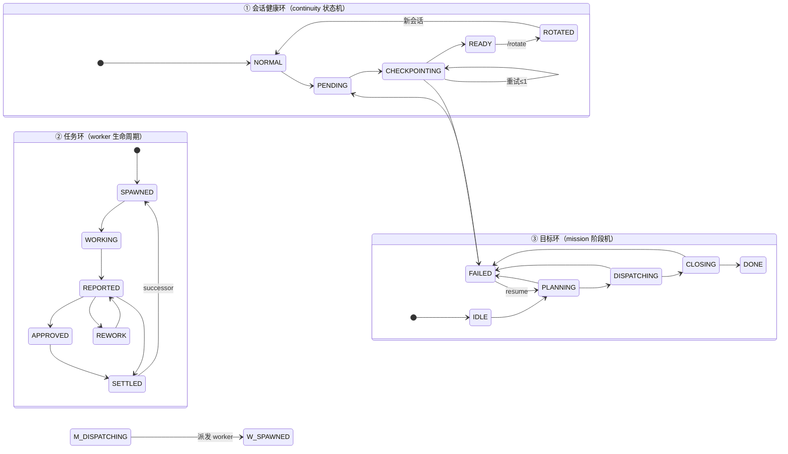
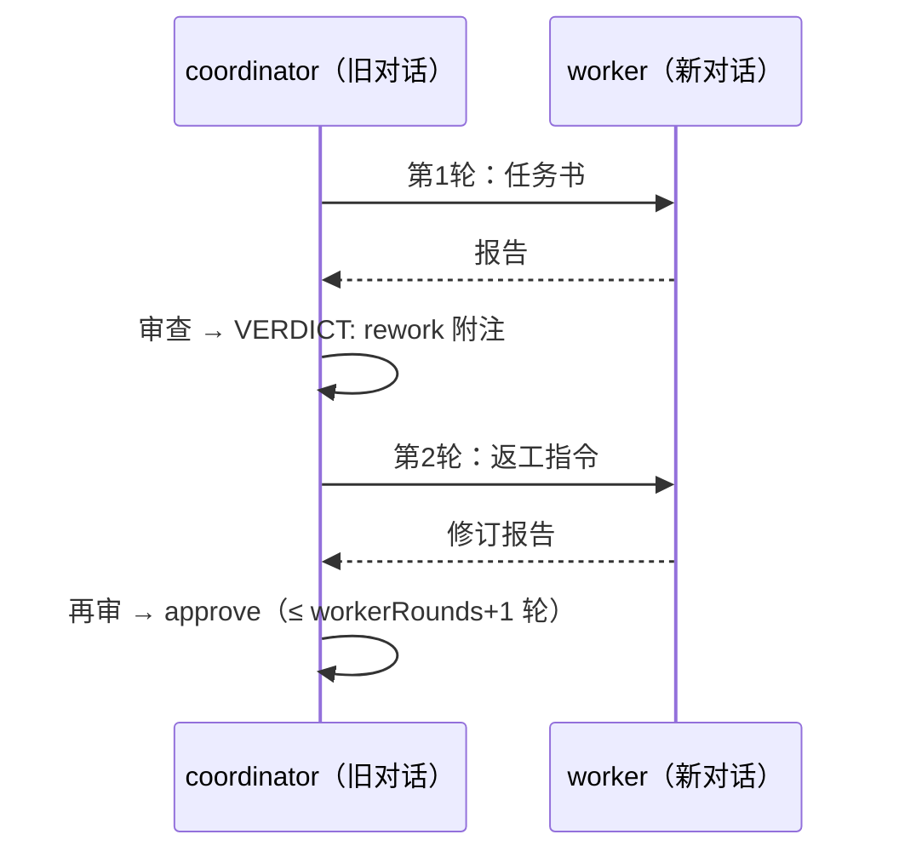
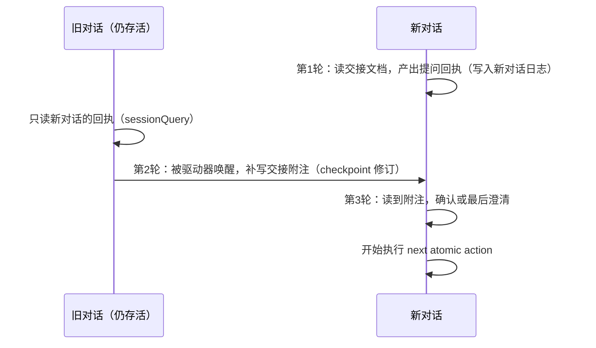

# STATES.md — 状态模型速查（三种环）

> 接力模式的全部行为 = **三种状态环**的组合。任何会话至少跑 ①；worker 叠加 ②；coordinator 叠加 ③。
> 环与环之间只有两个固定接点：`/rotate` 把 ① 环接到新会话；mission 派发把 ③ 环接到 ② 环。

## ① 会话健康环（每个会话）

**拥有者**：预设插件 v5（standing mount 每代一份，状态按 sessionId 键控）。
**持久证据**：checkpoint 是日志里带 `<!-- DSH_CONTINUITY_CHECKPOINT v1 -->` 的 assistant 消息（8 节 + 唯一 next action）。任何 `ready` 都以该消息的 seq 为证据；重启后从日志重推，**无假就绪**。

| 状态 | 含义 | 进入 | 离开 | 相关命令 |
|---|---|---|---|---|
| `NORMAL` | 正常干活 | 新会话/失败重来 | `/handoff`；压缩后自动准备 | `/continuity` |
| `PENDING` | 交接已排队 | `/handoff`（幂等） | 安全边界自动 steer | 无（等待） |
| `CHECKPOINTING` | 模型正在写 checkpoint | 安全边界（`agent/turn-stopping`/idle） | 持久校验通过 → READY；无效 → 重试 ≤1 → FAILED | 无 |
| `READY` | 交接就绪（有持久证据） | 校验通过 | `/rotate` → ROTATED；或继续干活 | `/continuity` 显示 seq |
| `FAILED` | 两次尝试都无效 | 重试耗尽 | 再 `/handoff` 重新排队 | `/continuity` 显示原因 |
| `ROTATED` | 已一键轮换 | `/rotate` 成功 | 旧会话保持存活（归档可选） | `/rotate` |

**护栏**：steer 只发生在安全边界（绝不打断工具调用）；`/rotate` 链保护（`parentSession` 非空的会话拒绝再轮换）；`/continue` 只做 checkpoint 的 next atomic action。

## ② 任务环（每个 worker）

**拥有者**：worktree 驱动器 v3（出生/通道/清理）+ rotation v4（successor 接班）。
**载体**：独立会话（continuity 预设、`meta.cwd`=worktree、`parentSession`=coordinator、`delegationDepth: 1`）。

| 状态 | 含义 | 进入 | 离开 | 相关命令 |
|---|---|---|---|---|
| `SPAWNED` | worktree/目录已建、会话已派 | `/worktree <简报>`（授权门）或 mission 派发 | 任务书注入 → WORKING | `/workers` |
| `WORKING` | 执行单一任务 | 首条任务消息 | 写 `## Worker report` | `/worker-send`（实时追问） |
| `REPORTED` | 报告在日志中（持久） | worker 写完报告 | coordinator 裁决 | `/worker-report` |
| `APPROVED` | 裁决通过 | `VERDICT: approve` | → SETTLED | mission 自动裁决 |
| `REWORK` | 裁决返工（有界 ≤workerRounds） | `VERDICT: rework <note>` | 处理后再 REPORTED | `/worker-send` 下发指令 |
| `SETTLED` | 任务终结 | approve/停止/清理 | `/worker-successor <id>` 接班（继承 checkpoint） | `/worktree-cleanup`、`/worker-stop` |

**护栏**：worktree 创建带授权门（审批 `ask` 必须 `allowed-once`）；事务式回滚（非强制）；清理只删注册记录，目录/日志保留；worker 永不自动轮换——接班必须 coordinator 显式 `/worker-successor`（且同一 checkpoint 只派一次）。

## ③ 目标环（coordinator 的 mission）

**拥有者**：mission 驱动器 v2。**机制归驱动器**（超时/轮数/并发/预算全有界），**判断归模型**（分解/裁决/收口），交互走严格标记格式（`TASK|`、`VERDICT:`、mission marker）。

| 状态 | 含义 | 进入 | 离开 | 相关命令 |
|---|---|---|---|---|
| `IDLE` | 无 mission | 新会话/完成/失败 | `/mission <目标>` | `/mission status` |
| `PLANNING` | 模型分解目标 | 启动或 resume | 产出 ≤maxTasks 条 `TASK` 行 | 格式错重试 1 次 |
| `DISPATCHING` | 分批派发 ② 环 worker | 分解成功 | 全部任务出裁决 → CLOSING；预算耗尽 → FAILED | 每任务自动 `/worktree` |
| `CLOSING` | 收口 | 全裁决 | 持久 mission checkpoint → DONE | 模型写 `<!-- DSH_MISSION v1 -->` 6 节 |
| `DONE` | 收敛 | checkpoint 落地 | `/mission <新目标>` 或 `/mission resume`（幂等提示） | `/mission status` |
| `FAILED` | 阻塞 | 超时/预算/格式错误 | 显式 `/mission resume`（从 checkpoint 的 `## Goal` 节重建续跑） | 升级报告 steer 给 coordinator |

**护栏**：任何失败只影响对应阶段并显式升级（steer 阻塞报告），绝不静默扩张；resume 永远显式、绝不自动。

## 环的接点（全部）

1. **①→①（跨会话）**：`READY →( /rotate )→ 新会话 NORMAL`——快照注入先于唤醒，谱系 `parentSession`。
2. **③→②**：`DISPATCHING →( spawnWorker )→ SPAWNED`——每任务一个 worktree worker。
3. **②→②（跨会话）**：`SETTLED →( /worker-successor )→ 新 worker SPAWNED`——继承终 checkpoint 与 cwd。
4. **②→③（回传）**：worker 的 `## Worker report` 被 mission collect，裁决写回 ③ 环任务矩阵。
5. **任意环 ↔ 人**：所有"就绪/完成"状态都有持久证据，人随时可接手（`/worker-report`、`/mission status`、`/continue`）。

## 多轮交接问答：现状与设计

**现状：交接是单程。** 旧对话写 checkpoint → 新对话注入快照 → 只做下一步。问答式的来回目前只存在于 mission 的审查-返工（coordinator 与 worker 之间，**有界** `workerRounds`）：

**设计（后续选项）：新旧对话之间的 3 轮问答**。前提是旧对话仍存活、且由驱动器按需再次唤醒；旧对话通过只读通道读新对话的"交接回执"，补写 checkpoint 附注，新对话再读——全程有界（默认 ≤3 轮，`handshake-max-rounds`）：

> 两种形态共享同一原则：**轮数有界、每轮有持久证据、超时即降级为单程交接**，绝不无限对话。
